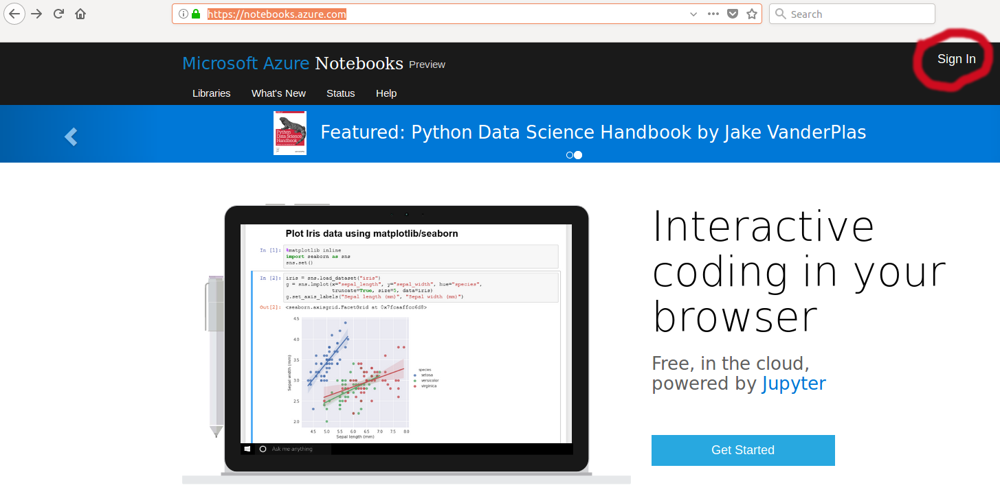
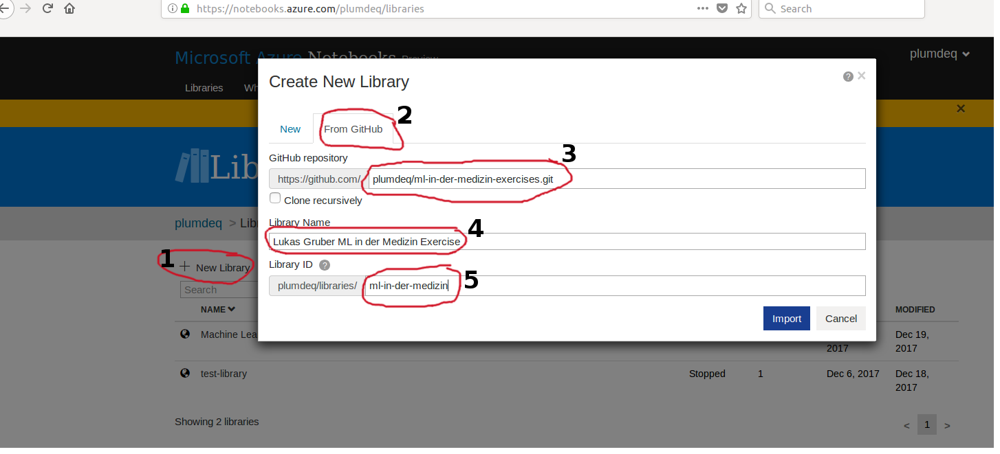
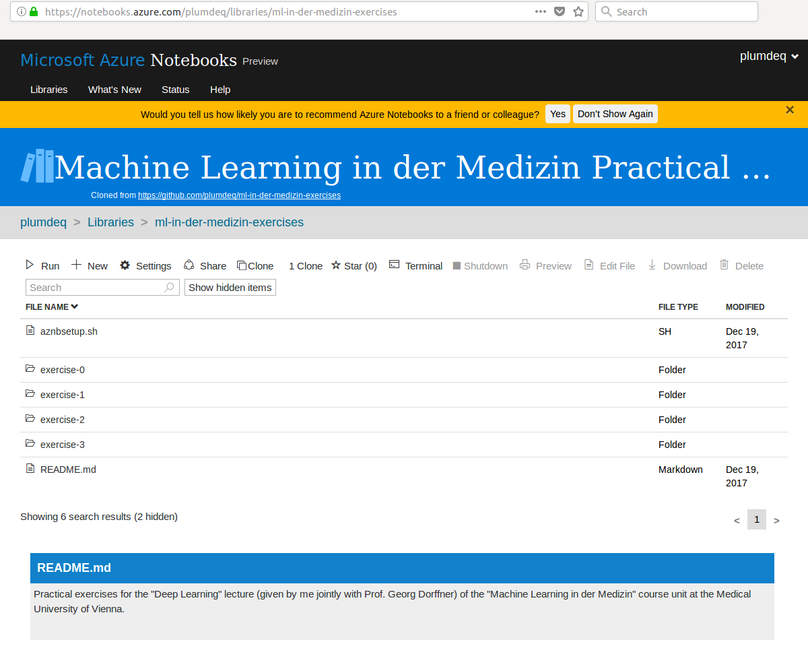
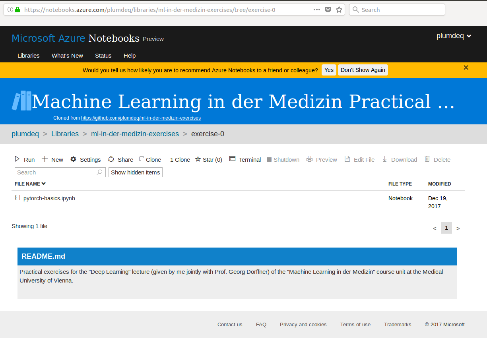
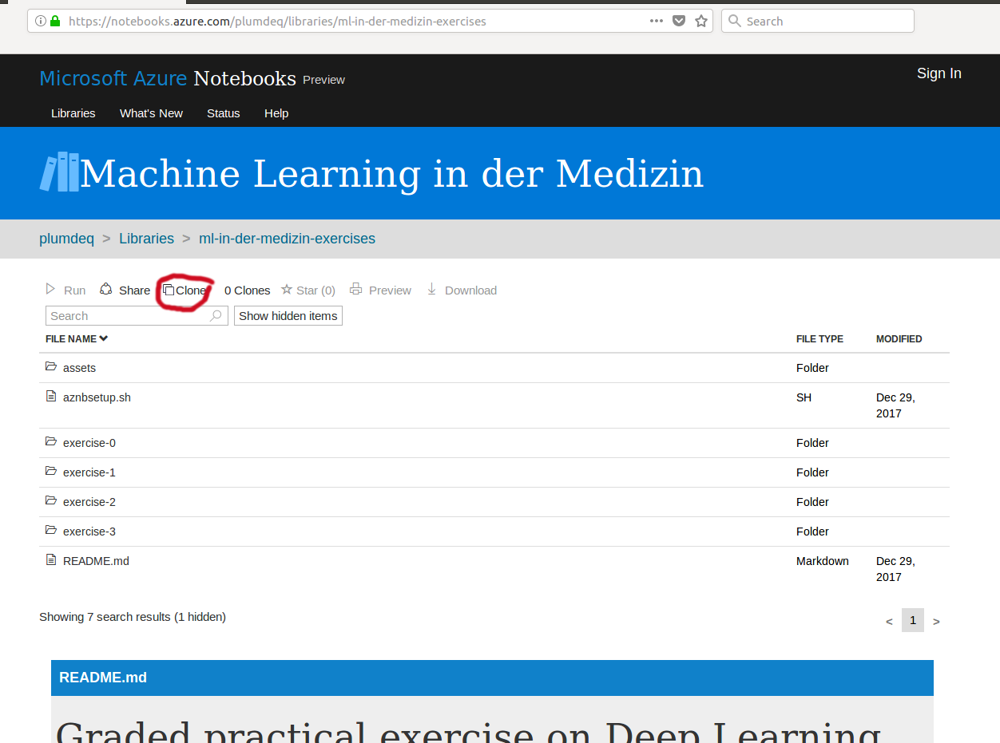
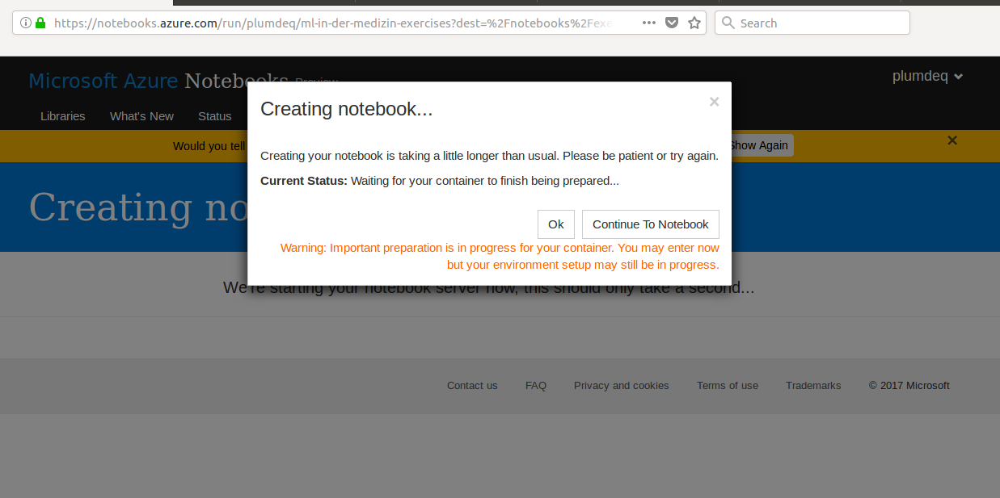
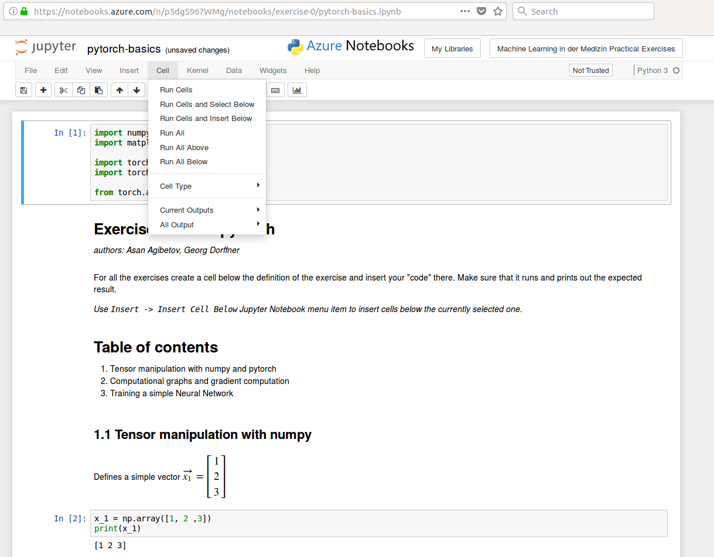
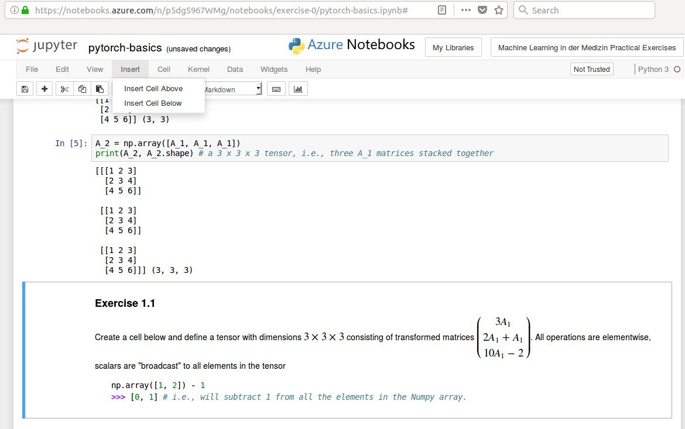

# Graded practical exercise on Deep Learning

## Updates

**LATEST UPDATE: Wed Jan 17 10:01:48 2018 AM CET**

* **Wed Jan 17 10:01:48 2018 AM CET**
    * Corrected error in Exercise 2.1 (thanks Niklas). To remedy the issue, now
      contains a hint on the solution.
* **Fri 29 Dec 2017 11:15:39 AM CET**
    * Corrected errors in `exercise 1` (many corrections in the whole notebook)

## Description

Practical exercises for the "Deep Learning" lecture (given by me jointly with
Prof. Georg Dorffner) of the "Machine Learning in der Medizin" course unit at
the Medical University of Vienna.

In this practical exercise you will get a hands-on experience with writing your
first Deep Learning programs with applications to medical imaging. We will be
using Python as our main programming language, and pytorch[^1] as our main
package for writing deep learning applications. To facilitate all the
installation hassle, we opted for the cloud-based integrated environment -
Microsoft Azure Notebooks[^2]. Microsoft Azure Notebooks are a service running
Jupyter Notebooks[^3] - open-source web application that allows you to create
and share documents that contain live code, equations, visualization and
narrative text. Since we are using Python we will be using Jupyter Python
Notebooks (note that Jupyter Notebook exists for other programming languages as
well).

*If you want to prepare these exercises locally, make sure that you have access
to a Unix-based machine (Linux, Mac OS X), and if yes, skip to the `Local
environment preparation`.*

[^1]: http://pytorch.org/
[^2]: https://notebooks.azure.com/
[^3]: http://jupyter.org/

If you have never used Jupyter Notebook before, we suggest you take a small
introductory tutorial. There are many available online, for instance this
tutorial[^4].

[^4]: https://youtu.be/EEEZX_0FMEc

## Cloud environment preparation

To use Microsoft's cloud platform all you need is a valid Microsoft account (in
some cases even a Skype account might suffice). Head over to
`https://notebooks.azure.com/` and *sign in* (or sign up if you don't have a
Microsoft account), just as indicated in the image below.

{width=100%}

### Clone repository from GitHub (preferred)

*If cloning from GirHub is not possible, clone the repository from Microsoft
Azure Libraries (next section)*

Next, you need to clone the Python code which you will use for the exercises,
use the following image in conjunction with the numbered instructions below:

{width=100%}

1. Go to `Libraries` and *add a new library* (click on `+`)
2. In the newly appeared modal window choose `From GitHub`
3. Enter `plumdeq/ml-in-der-medizin-exercises.git` in the *GitHub* repository
   field
4. Enter a library name that follows `NAME SURNAME ML in der Medizin Exercise`
   pattern (change `NAME, SURNAME` to match your name and surname)
5. Enter `ml-in-der-medizin`
6. Press `import`

The code that you need to accomplish this exercise will be imported from
GitHub (`plumdeq` is the GitHub username of Asan Agibetov). When you click on
the name of the library that you just imported you should see the similar
content as in image below. 



Namely, you will have four folders `exercise-0`,
`exercise-1`, `exercise-2` and `exercise-3`. Inside each of these folders you
will find the respective notebooks with python code and equations, which you
can interactively run and explore.




## Clone from Microsoft Azure Notebooks Libraries

After having successfully signed in to your Microsoft Azure Notebooks account,
clone the repository hosted on Azure cloud. To do so, head over to
`https://notebooks.azure.com/plumdeq/libraries/ml-in-der-medizin-exercises`
(personal libraries of Asan Agibetov) and click on `Clone` to replicate the
library in your own libraries collections. Use the image below for guidelines,
consult naming conventions described in the section `Clone from GitHub`.


{width=100%}


## Local environment preparation

Primary dependency of all these exercises is `pytorch`[^1] and
`pytorch-vision`. Head over to the official installation instructions
(Unix-based systems only). In addition, you will need to install a few other
Python packages. Overall, to prepare your environment, provided your system
supports `pytorch`, issuing the following commands should suffice. If you are
inexperienced with Python package installations, and/or experiencing too many
issues with installations, we suggest to opt for the cloud environment.

```
pip3 install tqdm numpy matplotlib
```

## Running exercises

Once your environment is set up, it is time to start doing the exercises. Click
on the `*.ipynb` notebook inside one of the exercise folder. At first, you will
see a notification that Microsoft Azure Notebook needs to download and install
required packages (`pytorch` and other packages), be patient, it might take
some minutes.



The order of the exercises matters, so start with the 0th and continue on to
the 3rd. Each notebook (exercise) contains intermingled python code and text
(sometimes with math equations), the accompanying text explains what the code
should do. Again, the exercise is meant to be executed *sequentially*. Select
sequentially cells with python code (those that have `In [ ]` to the left of
them) and run them (use menu toolbar `Cell > Run Cells` as depicted in the
figure below. If you struggle to be *fluent* with Jupyter Notebook, we suggest
watching introductory tutorials online [^4]).



The question exercises are marked with *Exercise x.x* headings, and require
*input* from you! This is your chance to demonstrate that you understood the
material presented to you during the lectures and practical exercises. You will
be required to either *create a new cell with python code* and execute it, or
add *a new cell with markdown text* whenever we ask you to provide an answer
with text.



## Handing in your answers

The beauty of Jupyter notebooks is that they can be exchanged online with all
of the execution results saved within them. Thus, you could hand-in your
notebooks directly. Alternatively, you could make a report by including the
screenshots, and/or replicating the *outputs* of the cells in your report
manually.

## Troubleshooting

Contact your instructors via email in case of issues or if something is
unclear

* `asan.agibetov@meduniwien.ac.at`  
* `georg.dorffner@meduniwien.ac.at`
